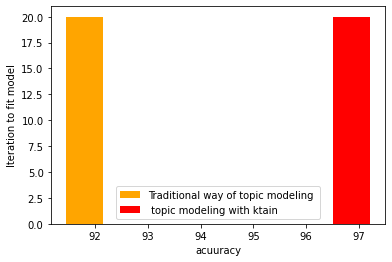
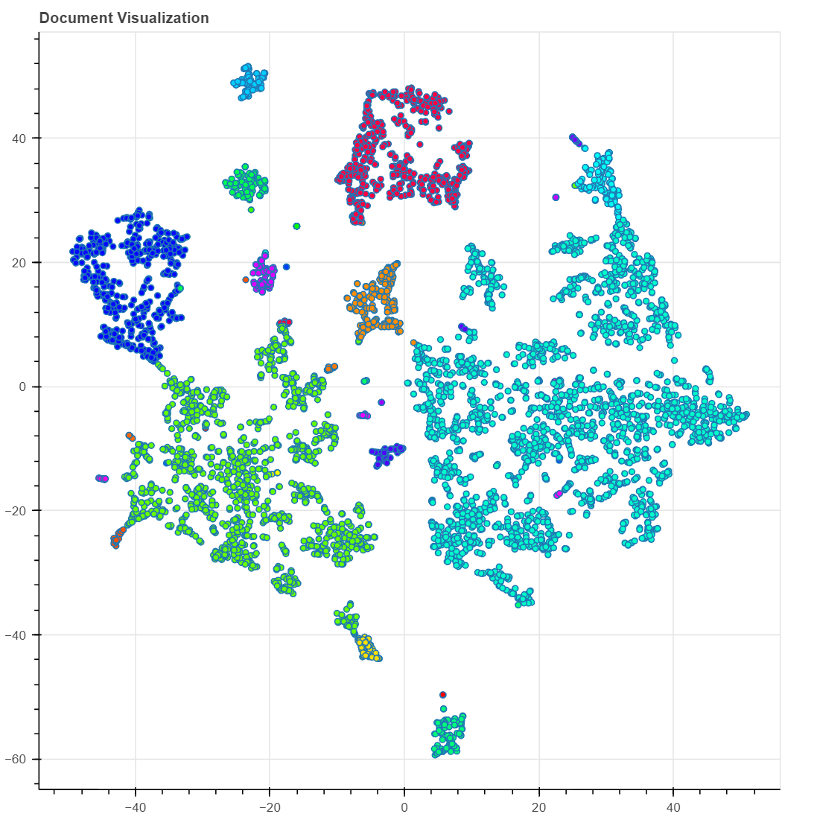

# Topic_modeling_with_Ktrain_and_LDA

## 1. What is topic modeling  ?
**:- [Answer](https://monkeylearn.com/blog/introduction-to-topic-modeling/)**

## 2. what is Topic recomendation system ?
**:- [Answer](https://towardsdatascience.com/a-guide-to-collaborative-topic-modeling-recommender-systems-49fd576cc871#:~:text=Recommender%20Systems%20are%20a%20broad,give%20to%20an%20item%20i.)**

## 3.Implementation :

**Ktrain :** https://github.com/amaiya/ktrain

**20_Newsgroup Dataset :** https://www.kaggle.com/crawford/20-newsgroups

**Amazon_Food_reviews Dataset:** https://www.kaggle.com/snap/amazon-fine-food-reviews

**Anvil for UI :** https://anvil.works/articles/python-gui-builder-web

**Topic Clustering:** https://www.kaggle.com/d4v1d3/cord-19-lda-topic-modeling-reccomendation-system

## 4.Bench Marks:

**Traditional Way vs Ktrain**

## 5.Visualization :

**Topic clustering**

## Reference :
[kgptakie](https://kgptalkie.com/category/natural-language-processing-nlp/)
[kaggle](https://www.kaggle.com/canggih/topic-modeling)
[K-means](https://www.kaggle.com/thebrownviking20/k-means-clustering-of-1-million-headlines)

| **status**|
|-----------|
|in progress|
